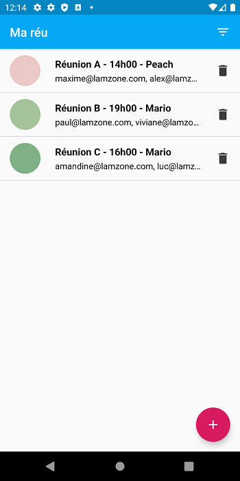
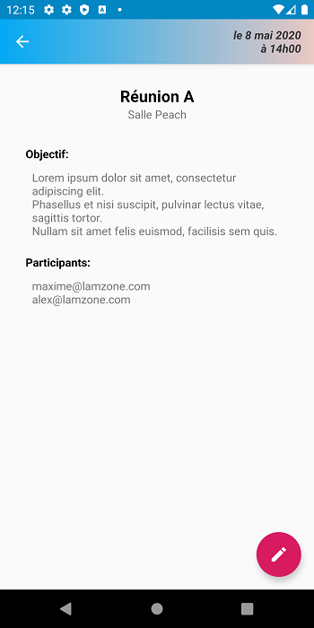
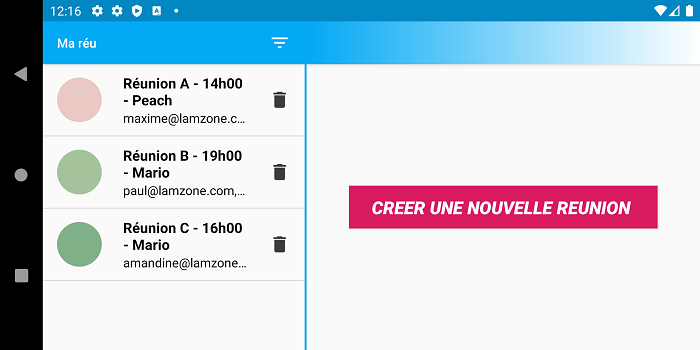

# MaReu
**School project**

My goal was to create a meetings management app, without using any data persistence.

Functionalities :
- Plan a meeting
- Display the list of meetings
- Filter meetings by date and hour.
- See the details of each meeting.
- Delete a meeting.

 | 

**Library**
- [ButterKnife](https://github.com/JakeWharton/butterknife)
- [ChipCloud](https://github.com/adroitandroid/ChipCloud)
- AndroidX
