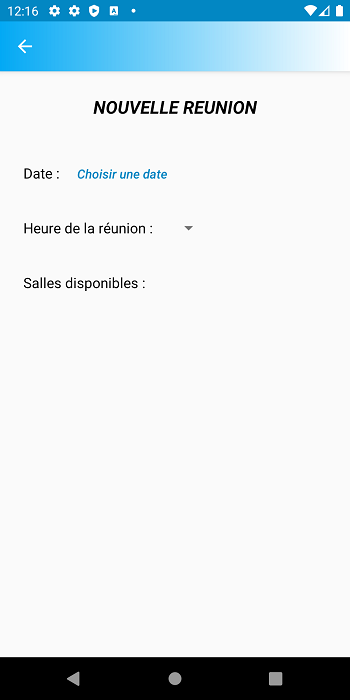

# **Projet Mareu**

Maréu est une application de gestion de réunions.

Cette application permet :
- De créer des réunions
- D'afficher la liste des réunions
- De les filtrer par date et heure 
- De voir chacune des réunions en détail
- Et de les supprimer.

 | 

## Prerequis 
**Obtenir le projet:** 
Clicker sur "Clone or Download" en haut à droite du projet sur Github, télécharger et extraire
le fichier zip sur votre ordinateur.

**Logiciel nécessaire:**
Android Studio ([Comment installer Android Studio](https://developer.android.com/studio/install) )

Assurez vous d'installer un émulateur ou de configurer votre smartphone Android en mode développeur afin de pouvoir 
lancer l'application.

## Lancer le projet

Dans Android Studio, ouvrez le projet que vous venez de télécharger
et, si ce n'est pas fait automatiquement, cliquez sur "Sync project with Gradle Files" (menu "File")
puis clickez sur "Build Project" (menu "Build"). 

**Lancer l'application:** Cliquez sur le bouton "play" ou sélectionnez "Run 'app' " dans le menu "Run".

## Lancement des tests unitaires et UI

Vous trouverez les test unitaires dans le dossier "test" et les tests instrumentalisés
dans le dossier "androidTest". 

**Lancer tous les tests d'une même classe:** Click droit sur le nom de la classe
et appuyez sur "Run 'NomDeLaClasse'".  

**Lancer les tests un par un:** Click droit sur le nom de la méthode @Test que vous désirez lancer,
et appuyez sur ""Run 'NomDeLaMethode'". 